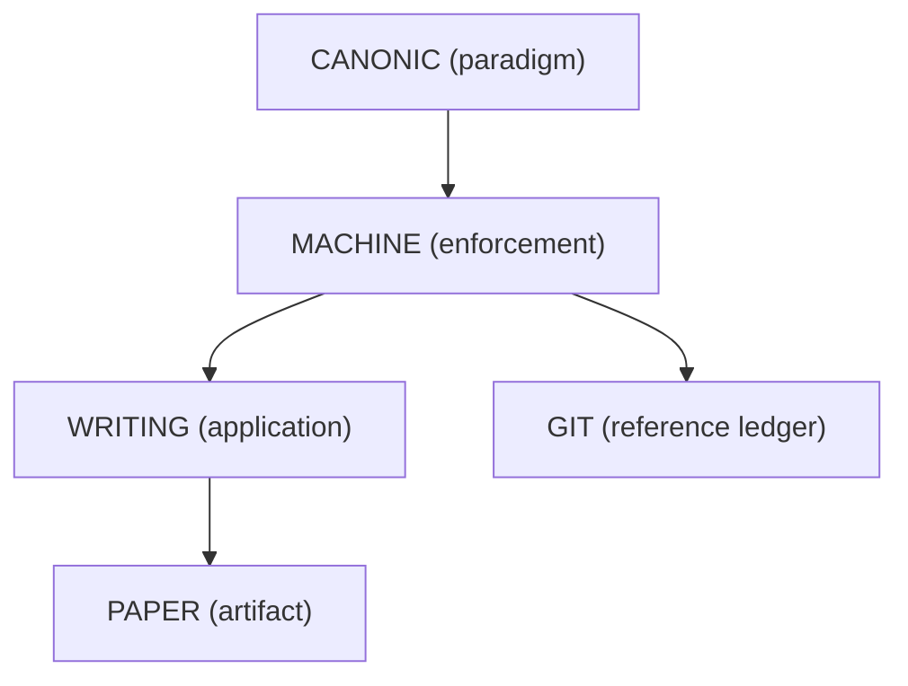

# CANONIC

1. Purpose
   - Define the structure and intent of the CANONIC scope.

2. Scope
   - Applies to `/canonic` and informs inherited scopes (`/machine`).

3. Normative language
   - The key words **MUST**, **MUST NOT**, **SHOULD**, **SHOULD NOT**, and **MAY** are to be interpreted as described in RFC 2119.
   - Statements using these key words are normative.
   - Diagrams and examples are non-normative unless explicitly marked otherwise.

4. Reference architecture (non-normative)
   - One possible composition of downstream layers is shown below:
   - CANONIC (paradigm) → MACHINE (enforcement) → WRITING (application) → PAPER (artifact)
   - GIT is a reference ledger substrate for recording state transitions (e.g., canon changes).

5. Constraints
   - SPEC MUST be human-first and MAY describe machine architecture without implementing it.
   - SPEC MUST state how CANON, VOCAB, and README relate.
   - CANON MUST state enforceable axioms for the scope: triad, inheritance, and introspection.
   - VOCAB MUST be CANON-closed and MUST define the concepts referenced by CANON and itself.
   - VOCAB MUST be concept-only: each concept is defined once; no duplicate entries for grammatical variation.
   - SPEC filename MUST match the repo name (case-insensitive) and MUST be unnumbered.
   - README MUST use only concepts defined by VOCAB.
   - Generation method: a CANON SHOULD be derivable as minimal axioms from this SPEC; a VOCAB SHOULD be derivable from CANON and its concept set (CANON-closed); README SHOULD be checkable for VOCAB-concept use.
   - Fixed point: applying the generation method to this SPEC SHOULD yield a triad that does not change on regeneration.
   - MACHINE implementations SHOULD apply these constraints and MAY provide templates for CANON, VOCAB, and README.

6. Validation
   - Confirm that SPEC is human-first and MAY describe machine architecture without implementing it.
   - Verify that SPEC states how CANON, VOCAB, and README relate.
   - Verify that CANON states enforceable axioms for triad, inheritance, and introspection.
   - Verify that VOCAB is CANON-closed and README uses VOCAB concepts.
   - Verify that VOCAB is concept-only with no duplicate entries for grammatical variation.
   - Verify that SPEC filename matches the repo name (case-insensitive) and is unnumbered.
   - Verify that CANON and VOCAB can be regenerated from this SPEC using the generation method.
   - Verify that regeneration is a fixed point (no changes after regeneration).
   - Confirm that MACHINE implementations apply these constraints and may provide templates.

7. Consumption notes
   - Downstream layers inherit these constraints without contradicting the root CANON.
   - When concepts are added to CANON in this scope, downstream VOCABs must include them.

8. Inheritance notes
   - Downstream layers inherit this spec and may add constraints without contradicting the root CANON.

This SPEC is part of the CANONIC triad.
