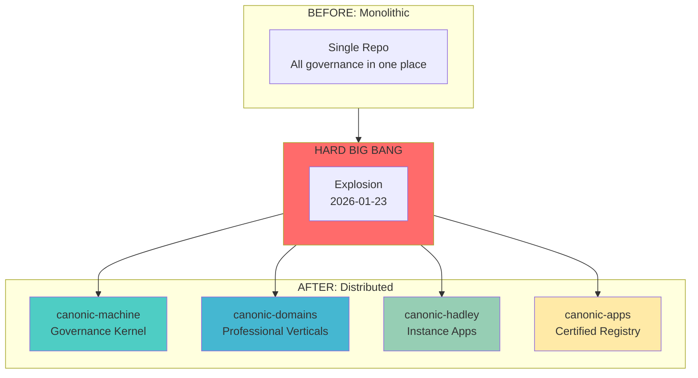
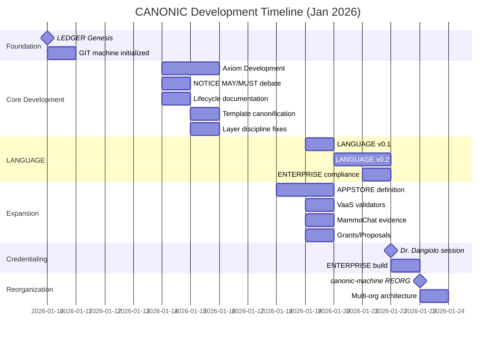
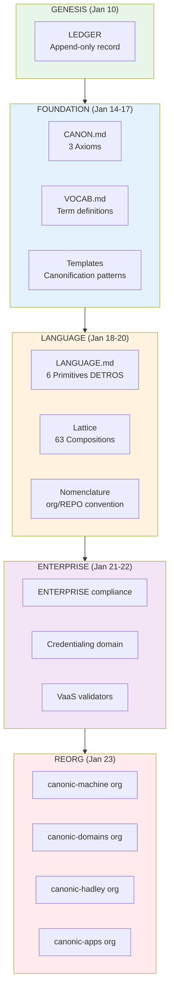
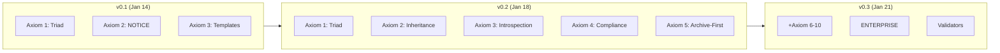
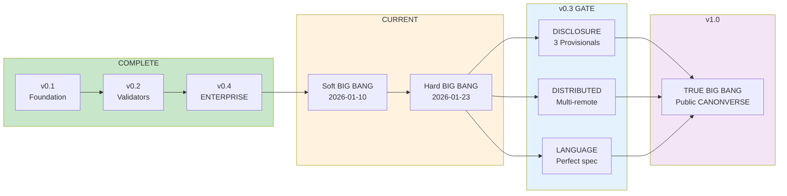

# CANONIC EVOLUTION REPORT

## Proto-CANONIC Evidence (Pre-Genesis)

Before the BIG BANG, there was proto-canonic activity documented in PAPER:

| Date | Commit | Evidence |
|------|--------|----------|
| 2026-01-11 | `5dc73a8` | ep127 - vocab stub minimality insight |
| 2026-01-11 | `762a28e` | Triad reduced to minimal paradigm pattern |
| 2026-01-11 | `e5115d2` | ep128 - vocab-closure layer violation |
| 2026-01-11 | `edd5358` | ep129 - episode axiom layer violation |
| 2026-01-12 | `0b00a77` | ep130 - agent-model correlation analysis |

The episode numbers (ep127-130+) reveal **extensive pre-CANONIC collaboration sessions** — the intellectual foundation that preceded formalization.

**Key Proto-Insight (from v0 manuscript):**
> "We cured AI slop in 21 days by recognizing that the cure is 50 years old."
>
> "Compiler theory solved this in the 1960s. Invalid programs don't compile."

The compiler analogy was the proto-canonic seed that became CANONIC.

**MammoChat Evidence:**
- FCIF Grant 354 (Florida Cancer Innovation Fund)
- 20,000+ patient encounters
- UCF Lake Nona development
- AdventHealth partnership evidence

Link: [canonic-machine/PAPER](https://github.com/canonic-machine/PAPER)

---

## The Soft BIG BANG

On **2026-01-10**, commit `d578676` initialized the LEDGER with a single message:

```
Initialize GIT machine
```

This was the **GENESIS** - the moment the canonverse began. From this singularity, all governance, all axioms, all domains, and all applications emerged through deterministic evolution.

The BIG BANG property of CANONIC means the entire system can be regenerated from its minimal fixed point:

```
MINIMAL_FIXED_POINT = LANGUAGE + VALIDATORS

BIG BANG regeneration:
1. Archive everything except LANGUAGE and VALIDATORS
2. Regenerate CANONIC/ from LANGUAGE
3. Regenerate APPSTORE/ from VALIDATORS
4. Regenerate DOMAIN/ from domain specifications
5. Restore .github/ and .transcripts/
```

**Genesis Commit:** [`d578676`](https://github.com/canonic-machine/LEDGER/commit/d578676) — LEDGER, 2026-01-10

---

## The Hard BIG BANG (DISTRIBUTED)

On **2026-01-23**, commit `9ec7cc9` marked the **HARD BIG BANG** — the moment CANONIC became DISTRIBUTED:

```
init: canonic-machine kernel
```

The monolithic canonverse exploded into a multi-org architecture:



**Why Distributed?**
- **Ownership boundaries**: Each org has independent versioning
- **Governance isolation**: canonic-machine is immutable kernel
- **Domain specialization**: canonic-domains holds professional verticals
- **Instance separation**: canonic-hadley holds Hadley Lab applications
- **Certification registry**: canonic-apps tracks certified applications

**Hard BIG BANG Commit:** [`9ec7cc9`](https://github.com/canonic-machine/canonic/commit/9ec7cc9) — canonic, 2026-01-23

---

## Timeline



---

## Commit Activity

| Date | Commits | Key Events |
|------|---------|------------|
| 2026-01-10 | 1 | **LEDGER Genesis** - GIT machine initialized |
| 2026-01-14 | 7 | Axiom development, NOTICE MAY/MUST debate |
| 2026-01-15 | 14 | Template canonification, layer discipline |
| 2026-01-16 | 10 | VOCAB closure, nomenclature standardization |
| 2026-01-17 | 2 | README generation as binary |
| 2026-01-18 | 6 | Axiom 5 (Archive-First), APPSTORE definition |
| 2026-01-19 | 42 | **Peak activity** - LANGUAGE v0.1, VaaS, MammoChat, Proposals |
| 2026-01-20 | 2 | LANGUAGE v0.2, aaS mapping |
| 2026-01-21 | 10 | ENTERPRISE compliance, TRIAD completion |
| 2026-01-22 | 6 | **Dr. Dangiolo credentialing**, Stack reorganization |
| 2026-01-23 | 1 | **REORG** - canonic-machine kernel init |

**Total: 100 commits in 14 days**

---

## Architecture Evolution



---

## Key Milestones

### M0: SOFT BIG BANG (2026-01-10)
- **Commit:** `d578676` — "Initialize GIT machine"
- The singularity from which all governance emerged
- LEDGER established as append-only temporal foundation
- Link: [canonic-machine/LEDGER](https://github.com/canonic-machine/LEDGER)

### M2: Axiom Crystallization (2026-01-14-15)
- CANON.md reduced to 3 pure axioms
- Triad pattern established (CANON + VOCAB + README)
- Layer discipline formalized

### M3: LANGUAGE Specification (2026-01-19)
- **DETROS** primitives defined (Declarative, Evidential, Temporal, Relational, Operational, Structural)
- 63-element lattice enumerated
- Nomenclature rules canonified

### M4: ENTERPRISE Compliance (2026-01-21)
- Full 6-primitive compliance achieved
- Validators wired to CI/CD
- Coverage and Roadmap closure

### M5: Credentialing Domain (2026-01-22)
- Dr. Dangiolo credentialing session
- MEDICINE domain instantiated
- Provider verification workflow established

### M6: HARD BIG BANG — Distributed (2026-01-23)
- **Commit:** `9ec7cc9` — "init: canonic-machine kernel"
- CANONIC becomes DISTRIBUTED across 4 organizations:
  - **canonic-machine**: Governance kernel (immutable)
  - **canonic-domains**: Professional domain axioms
  - **canonic-hadley**: Instance applications
  - **canonic-apps**: Certified app registry
- Link: [canonic-machine/canonic](https://github.com/canonic-machine/canonic)

---

## Credential Ledger Recovery

Providers credentialed across the canonverse evolution:

| Provider | NPI | Enumeration | Domain | Status |
|----------|-----|-------------|--------|--------|
| Mariana Dangiolo, MD | 1699796243 | 2006-07-21 | Family Medicine, Geriatrics | **Recovered** |
| Rajesh Tota-Maharaj, MD | 1316178445 | 2009-08-06 | Cardiology | Original |
| Dexter Hadley, MD/PhD | 1013143460 | 2009-05-29 | AI/Precision Medicine | Created |
| Hyrum Brodniak, DO | 1619319563 | 2013-07-20 | Family Medicine, OMM | Original |
| Andrew Wong, MD | 1659981751 | 2020-08-04 | Internal Medicine | Created |

**Note:** Dr. Dangiolo's credential file was lost in the REORG. Reconstructed from NPPES primary source on 2026-01-23 with historical reference to commit `f3c6ee7`.

---

## Axiom Evolution



---

## Statistics

| Metric | Value |
|--------|-------|
| Total commits (canonic) | 100 |
| Development days | 14 |
| Peak commits/day | 42 (Jan 19) |
| Organizations created | 4 |
| Domains defined | 9 |
| Primitives | 6 (DETROS) |
| Lattice elements | 63 |
| Providers credentialed | 5 |
| IDFs generated | 50+ |

---

## Repository Structure (Post-REORG)

```
canonic-machine/          ← Governance kernel
├── canonic/              ← Root axioms
├── LANGUAGE/             ← Specification
├── VALIDATORS/           ← Enforcement
├── LEDGER/               ← Immutable record
├── MACHINE/              ← Execution
├── OS/                   ← Operations
└── STACK/                ← Composition

canonic-domains/          ← Professional domains
├── MEDICINE/
├── FINANCE/
├── LAW/
├── SECURITY/
├── DATA/
├── GOVERNMENT/
├── DEFENSE/
├── SAFETY/
└── QUALITY/

canonic-hadley/           ← Instance applications
├── CREDENTIALING-APP/
├── MAMMOCHAT-APP/
├── PATENTS-PROTECTION/
├── GENOMICS-APP/
└── ...

canonic-apps/             ← Certified registry
├── REGISTRY/
└── MAMMOCHAT/
```

---

## Lessons Learned

1. **Git IS the ledger** - Commit history provides temporal integrity
2. **Transcripts are deterministic** - Session records enable reconstruction
3. **REORG can lose state** - Credential files not committed were lost
4. **Monotonic inheritance works** - No downstream contradictions
5. **6 primitives suffice** - DETROS covers all compliance domains

---

## Future Evolution

The canonverse continues to evolve. This document will be updated as:
- New domains are instantiated
- New providers are credentialed
- New axioms are discovered
- New applications are certified

---

## The Plan: v0.3 GATE → v1.0 BIG BANG

As we walked the canonverse, the roadmap revealed itself:



### v0.3 GATE Requirements

**All three must pass for v1.0:**

| Gate | Requirement | Status |
|------|-------------|--------|
| **DISCLOSURE** | Provisionals filed (3) | Pending |
| | arXiv published | Pending |
| | Evidence vault archived | Pending |
| **DISTRIBUTED** | Multi-remote (GitHub+GitLab+Codeberg) | Pending |
| | OpenTimestamps anchoring | Pending |
| | Real immutability proven | Pending |
| **LANGUAGE** | Can regenerate CANONVERSE | Pending |
| | All axioms captured | Pending |
| | No ambiguity | Pending |

### v1.0: The TRUE BIG BANG

```
v0.x = Private development (proof, priority, preparation)
v1.0 = Public launch (claims, community, canonical)
```

The TRUE BIG BANG will:
1. Archive current ledger to evidence vault
2. Regenerate virgin CANONVERSE from LANGUAGE SPEC
3. Launch INTO distributed ledger with genesis block
4. All scopes ENTERPRISE compliant from genesis

**The CANONIC Era begins.**

---

*Generated: 2026-01-23*
*Source: Git ledger analysis across canonic-machine org*
*Genesis: [`d578676`](https://github.com/canonic-machine/LEDGER/commit/d578676) — 2026-01-10*
