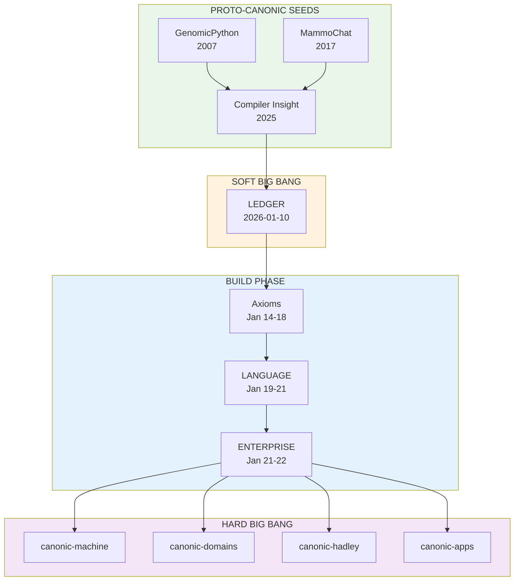

# EVOLUTION (/EVOLUTION/)

inherits: /

---

## Compliance

**Level:** ENTERPRISE

EVOLUTION is a system app that crawls the CANONVERSE and generates comprehensive self-documentation of how the platform emerged.

---

## Lifecycle

**State:** ACTIVE

**Domain:** CANONIC.EVOLUTION

---

## Axioms

### 1. Deterministic Replay

EVOLUTION MUST be reproducible from transcripts. The transcript ledger is the source of truth.

```
EVOLUTION = f(TRANSCRIPTS)

Where:
- TRANSCRIPTS = append-only session records
- f = deterministic extraction function
- Output = comprehensive timeline + configurations
```

### 2. Configuration Tracking

EVOLUTION MUST track all CANONBASE configurations over time.

```
CANONBASE configurations:
├── Proto-CANONIC (2007-2013)
│   └── GenomicPython: PhD thesis ledger
├── Pre-Genesis (2025-12 to 2026-01-09)
│   └── Episodes 001-126: intellectual foundation
├── Soft BIG BANG (2026-01-10)
│   └── LEDGER genesis: d578676
├── Axiom Phase (2026-01-14 to 2026-01-18)
│   └── 3 axioms → 5 axioms → 8 axioms
├── LANGUAGE Phase (2026-01-19 to 2026-01-21)
│   └── DETROS primitives, 63-element lattice
├── ENTERPRISE Phase (2026-01-21 to 2026-01-22)
│   └── Full 6-primitive compliance
└── Hard BIG BANG (2026-01-23)
    └── Distributed multi-org: canonic-machine kernel
```

### 3. Platform Emergence

EVOLUTION MUST document how configurations composed into a platform.

```
Platform = LANGUAGE + VALIDATORS + APPSTORE + DOMAINS

Emergence sequence:
1. LEDGER (temporal integrity)
2. CANON (governance constraints)
3. MACHINE (enforcement)
4. LANGUAGE (specification)
5. VALIDATORS (automation)
6. APPSTORE (distribution)
7. DOMAINS (professional verticals)
8. APPS (certified instances)
```

### 4. Transcript Crawling

EVOLUTION MUST crawl transcripts to extract:
- Key decisions and their rationale
- Axiom evolution and refinements
- Configuration transitions
- Violation/correction cycles
- IDF (Invention Disclosure Form) discoveries

```
Transcript sources:
├── /TRANSCRIPTS-EVIDENCE/raw/claude-code/
│   ├── *.jsonl (session logs)
│   └── */tool-results/*.txt (artifacts)
├── /PAPER/v0/episodes/
│   └── ep*.md (episode summaries)
└── Git commit messages
    └── Semantic history
```

### 5. Self-Documentation

EVOLUTION generates its own documentation. The app documents itself documenting the CANONVERSE.

```
Outputs:
├── EVOLUTION.md (comprehensive report)
├── TIMELINE.md (chronological events)
├── CONFIGURATIONS.md (canonbase states)
└── PLATFORM.md (emergence narrative)
```

---

## Data Model

```
Event:
  timestamp: ISO 8601
  source: transcript | git | episode
  type: decision | axiom | violation | correction | discovery
  content: string
  evidence: reference[]

Configuration:
  name: string
  date_range: [start, end]
  axiom_count: number
  primitive_count: number
  repos: string[]
  key_commits: commit[]

Platform:
  layers: Layer[]
  domains: Domain[]
  apps: App[]
  emergence_date: ISO 8601
```

---

## Proto-CANONIC Seeds

### GenomicPython (2007-2013)

```
Origin: PhD Thesis, University of Pennsylvania
PI: Junhyong Kim, Ph.D.
Title: "Genome-scale annotation of genetic factors
        underlying neurotransmission & neuropsychiatric disease"
Year: 2007
GitHub: https://github.com/iDrDex/GenomicPython (2013-10-09)
Status: 12 years dormant → resurrected as CANONIC.GENOMICS (2026)
```

The thesis IS the original ledger. GitHub didn't exist in 2007.

### MammoChat (2017-2026)

```
Origin: Bloomberg Foundation Grant (2017)
Evolution: UCF development → FCIF Grant 354 (2024)
Evidence: 20,000+ patient encounters
Status: Proto-CANONIC clinical validation
```

### Compiler Insight (2025-12)

```
Origin: Episode sessions (ep001-ep126)
Key Insight: "Governance is compilation"
Evidence: PAPER v0 manuscript
Status: The seed that became CANONIC axioms
```

---

## Platform Emergence Narrative



---

## Validators

```
validators/evolution/
├── transcript_crawler.py    # Extract events from transcripts
├── configuration_tracker.py # Track canonbase states
├── platform_analyzer.py     # Document emergence
└── self_documenter.py       # Generate outputs
```

---

## Integration

```
EVOLUTION → PAPER:
  - Provides historical evidence
  - Documents platform emergence
  - Traces intellectual lineage

EVOLUTION → ROADMAP:
  - Informs future planning
  - Shows what worked/failed
  - Identifies patterns

EVOLUTION → APPSTORE:
  - System app listing
  - Version history
  - Configuration snapshots
```

---
