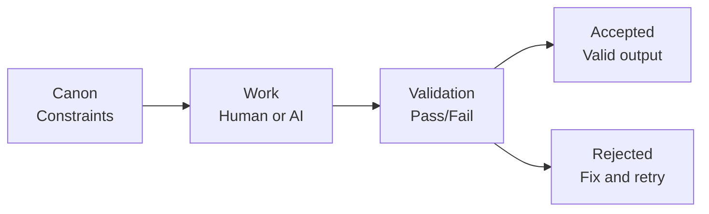

# CANONIC Programming

**Stop AI slop. Enforce durability.**

A programming paradigm that uses plain-English constraints + validation gates instead of executable code.

> **The Problem:** AI can generate anything. But can it maintain consistency? Prevent hallucinations? Ensure traceability?
>
> **The Solution:** Define constraints in plain English (CANONs). Validate every output. Accept only what passes. Like a compiler, but for meaning.

---

## Quick Start

**See it in action:**

1. Read [CANONIC.md](CANONIC.md) — CANONIC programming specification
2. Read [CANON.md](CANON.md) — Core governance constraints
3. Read [VOCABULARY.md](VOCABULARY.md) — Paradigm terminology
4. Explore [examples/](examples/) — Demonstrations
5. Check out [Writing Machine](https://github.com/canonic-machine/writing) — Complex FSM built on this paradigm

---

## The Core Idea

**Traditional programming:** Write instructions → compiler enforces syntax → program runs

**CANONIC programming:** Write constraints → validation enforces semantics → outputs accepted



**Key insight:** The canon IS the program. It defines what valid outputs look like. Validation is the execution.

**Git integration:** Each commit proposes a state transition. Pre-commit validation acts as a gate. Git history records the FSM execution trace. Failed transitions (reverts) trigger human review.

**Atomic commits:** Each commit addresses one logical change. Multiple unrelated changes require separate commits. This ensures clean history and independent revertibility.

---

## What Gets Validated

**Structure:**
- Required files exist
- Naming conventions followed
- Format rules satisfied

**Semantics:**
- Claims trace to sources
- Entities are registered before use
- Definitions exist for all terms

**Coherence:**
- No contradictions
- Inheritance rules respected
- Intent satisfied

---

## The Triad

Every governed directory must contain three files that form the self-describing foundation:

**[CANON.md](CANON.md)** — Constraints the LLM enforces
```markdown
Required artifacts: hello.txt
Rules:
  - hello.txt must exist
  - Content must be exactly: Hello, world.
```

**[VOCABULARY.md](VOCABULARY.md)** — Term definitions
```markdown
### hello world
The simplest canonic system. One file, one constraint.
```

**README.md** — Human-readable guide (this file)
- Generated from CANON.md + VOCABULARY.md + primary outputs
- Updates when source materials change
- Synthesizes governance into narrative documentation

---

## Minimal Triad Pattern

For any new governed directory, start with:

```
your-directory/
├── CANON.md      # Constraints (reference root protocols/patterns)
├── VOCABULARY.md # Term definitions (reference/inherit root terms)
└── README.md     # Human guidance (generated from sources)
```

Reference root CANON protocols and patterns whenever possible. Only specialize defaults; never restate or override invariants.

---

## Why This Matters

**CANONIC programming is a hedge against AI drift.**

- Canon defines validity **before** generation
- Validation blocks fluent-but-wrong output
- Same governance works across models and teams
- Outputs remain stable as systems scale

**Real example:** The [Writing Machine](https://github.com/canonic-machine/writing) uses CANONIC programming to enforce traceability across a 50-page user guide. Every claim traces to source episodes. Zero hallucinated references.

---

## What This Enables

Using CANONIC programming makes it possible to:

- **Build systems that survive model upgrades** — Canon is stable, models are swappable
- **Collaborate without drift** — Shared constraints, not just shared files
- **Audit outputs to requirements** — Every artifact traces to canon
- **Avoid AI slop** — Fluency doesn't override validity
- **Make work durable** — Outputs stay consistent over time
- **Self-document systems** — README regenerates from governance sources

---

## Introspective Properties

CANONIC systems exhibit six self-* properties that enable autonomous governance through **introspection** — the system's ability to examine and understand its own structure, behavior, and constraints.

### 1. Self-Validating

Systems implement dual validation: syntactic (structure) + semantic (constraints).

**Mechanism:**
- Syntactic validation checks structure (free, fast)
- Semantic validation checks meaning (expensive, LLM-based)
- Validators validate themselves before validating artifacts
- Validation convergence: semantic violations → canonified as syntactic constraints

**Question it asks:** *"Am I following my own rules?"*

### 2. Self-Optimizing

CANONs stay lean to minimize token cost across all operations.

**Mechanism:**
- Token cost = root CANON + parent CANONs + local CANON
- Verbose CANONs increase every validation cost
- No explanations, redundancy, or bloat in CANON.md
- Semantic violations converge to syntactic constraints (free checks)

**Question it asks:** *"Am I being as efficient as possible?"*

### 3. Self-Documenting

The triad generates complete documentation automatically.

**Mechanism:**
- README.md generated from CANON.md + VOCABULARY.md + primary outputs
- Pre-commit hook triggers regeneration when sources change
- Staleness validation blocks commits with outdated README
- No external documentation required

**Question it asks:** *"Can someone understand me without external help?"*

### 4. Self-Healing

Git history patterns trigger validation and corrective action.

**Mechanism:**
- Commit → Revert → Reapply signals failed validation
- Rapid CANON commits indicate drift
- Fix/violation keywords trigger comprehensive validation
- Atomic commits enable clean rollback

**Question it asks:** *"What violations am I exhibiting over time?"*

### 5. Self-Measuring

Git commit analysis reveals system maturity.

**Mechanism:**
- Producer commits: "Canonify [pattern]" (learning)
- Consumer commits: "Apply [constraint]" or "Fix [violation]" (enforcing)
- Producer ratio = Producer / (Producer + Consumer)

**Maturity thresholds:**
- New system: >40% producer (rapid learning)
- Maturing: 10-30% producer (refinement)
- Mature: <10% producer (stable enforcement)

**Question it asks:** *"How mature am I? Still learning or enforcing?"*

### 6. Self-Strengthening

Introspection cycles canonify discovered patterns.

**Mechanism:**
- Work → Introspection → Learning → Canonification → Meta-Pattern Discovery
- Three depth levels: fix violations, fix validators, fix architecture
- Meta-patterns about improvement are themselves canonified
- System learns how to learn better (recursive strengthening)

**Question it asks:** *"What can I learn? Why wasn't this caught?"*

---

## Core Concepts

### Canon
A written set of constraints. Defines what must be true and what must not occur.

### Constraint
A rule that narrows outcomes to a checkable set. Must be verifiable through validation.

### Validation
Pass/fail check. Does the artifact satisfy canon constraints? Not subjective—binary compliance.

### Artifact
Any output under governance. Documents, diagrams, indices, ledgers, code files.

### State
Defined by which artifacts exist and which constraints they satisfy.

### Invariant
Constraint that cannot be overridden. Must hold across entire inheritance chain.

### Protocol
Reusable validation or generation pattern. Define once, reference many times.

### Git Commit as FSM Transition
Each git commit proposes a state transition. Pre-commit validation gates accept valid changes and reject invalid ones, triggering backflow to the source state.

### Git History as FSM Log
Git commit history serves as the complete execution trace of the CANONIC FSM. Revert patterns signal failed validation attempts.

### Producer Commit
Git commit that adds new constraints to CANON.md or extracts patterns into protocols. Message pattern: "Canonify [what was learned]". Signals system discovered something new.

### Consumer Commit
Git commit that applies existing CANON constraints or fixes detected violations. Message patterns: "Apply [constraint]" or "Fix [violation]". Signals system enforced existing rules.

### Introspection
The system's ability to examine and understand its own structure, behavior, and constraints. Unifies all self-* properties as different aspects of self-awareness and self-regulation.

See [VOCABULARY.md](VOCABULARY.md) for complete definitions.

---

## Documentation Generation (Self-Documenting in Action)

This README is generated according to the **documentation protocol** defined in [CANON.md](CANON.md#L353-L387).

**Generation mechanism:**
- Input sources: [CANON.md](CANON.md) + [VOCABULARY.md](VOCABULARY.md) + git history
- Trigger: When CANON.md or VOCABULARY.md changes
- Validation: README staleness check via timestamps
- Automation: [Pre-commit hook](examples/git-hooks/pre-commit) enforces synchronization

**To regenerate this README:**
1. Edit [CANON.md](CANON.md) or [VOCABULARY.md](VOCABULARY.md)
2. Run documentation generation (LLM agent with protocol)
3. Stage both source changes and updated README
4. Commit atomically: `git add CANON.md VOCABULARY.md README.md`

**Staleness validation:**
```bash
examples/git-hooks/validate-readme-freshness.sh
```

This ensures README always reflects current governance state.

---

## Examples

### Canonic README
A governed README with structural requirements.
- [examples/canonic-readme/](examples/canonic-readme/)

### Complex Application
See [Writing Machine](https://github.com/canonic-machine/writing) for a complete FSM (episodes → assets → prose → output) built on this paradigm.

---

## Repository Structure

```
canonic/
├── CANONIC.md                  # CANONIC programming specification
├── CANON.md                    # Core governance constraints
├── VOCABULARY.md               # Paradigm terminology
├── README.md                   # This documentation (generated)
├── PROTOCOLS.md                # Reusable validation/generation patterns
└── examples/                   # Demonstrations
    ├── canonic-readme/
    └── git-hooks/              # Example git automation scripts
        ├── pre-commit              # README regeneration trigger
        ├── validate-readme-freshness.sh
        └── README.md               # Hook documentation
```

Every governed directory contains the triad: CANON.md, VOCABULARY.md, README.md.

---

## System Maturity

This governance repository is in **rapid learning phase** (50% producer ratio).

**Current metrics (as of latest analysis):**
- Total commits: 52
- Producer commits: 26 ("Canonify" pattern)
- Consumer commits: 5 ("Apply" or "Fix" pattern)
- Producer ratio: **50%**

**Maturity thresholds (from [CANON.md](CANON.md)):**
- **New system**: >40% producer commits (rapid learning phase) ← **We are here**
- **Maturing system**: 10-30% producer commits (refinement phase)
- **Mature system**: <10% producer commits (stable enforcement)

**Recent canonifications:**
- Human-in-the-loop governance requirement
- Commit message patterns for measurability
- Primary outputs documentation requirement
- README generation protocol (self-documenting)
- Self-measuring and self-strengthening properties

**Interpretation:** High producer ratio indicates active discovery of governance patterns. System is still learning what constraints it needs. As patterns stabilize, producer ratio will decrease and consumer ratio will increase (more enforcement, less discovery).

---

## How to Use This Repository

### For Understanding
1. Read [CANON.md](CANON.md) — Core governance constraints
2. Study [VOCABULARY.md](VOCABULARY.md) — Understand terminology
3. Explore [examples/](examples/) — See implementations
4. Review [PROTOCOLS.md](PROTOCOLS.md) — Reusable patterns

### For Building
1. Start with [examples/canonic-readme/](examples/canonic-readme/) as template
2. Create directories with the triad: CANON.md, VOCABULARY.md, README.md
3. Write constraints in CANON.md
4. Generate artifacts that satisfy constraints
5. Validate outputs against constraints
6. Install [git hooks](examples/git-hooks/) for automation

### For Contributing
1. Install pre-commit hook: `cp examples/git-hooks/pre-commit .git/hooks/pre-commit && chmod +x .git/hooks/pre-commit`
2. Follow atomic commit discipline (one logical change per commit)
3. Use commit patterns: "Canonify [pattern]" (producer) or "Apply/Fix [constraint]" (consumer)
4. Regenerate README when CANON or VOCABULARY changes
5. Maintain triad coherence in all governed directories

---

## What Makes This Different

| Traditional Programming | CANONIC Programming |
|------------------------|---------------------|
| Imperative (how to do) | Declarative (what must be true) |
| Compiler enforces syntax | Validation enforces semantics |
| Code drifts over time | Canon enforces stability |
| Hard to audit | Every artifact traces to canon |
| AI generates slop | AI generates, validation blocks slop |
| Static documentation | Self-documenting (README auto-generated) |
| Manual governance | Introspective (self-measuring, self-strengthening) |

---

## Applications

CANONIC programming works for any system where consistency matters:

- **Documentation** — READMEs, technical specs, API docs
- **Knowledge systems** — Wikis, knowledge bases, structured content
- **Research** — Papers, citations, reproducible claims
- **Complex writing** — Books, proposals, multi-author projects (see [Writing Machine](https://github.com/canonic-machine/writing))
- **Configuration** — System configs, deployment specs, infrastructure as code

Anywhere AI might generate slop, CANONIC programming blocks it.

---

## Non-Negotiables

- Canon defines validity
- Validation gates acceptance
- If output fails, fix inputs or canon—never polish downstream
- Fluency never substitutes for validity
- Humans govern; AI produces; validation enforces
- README must reflect current CANON and VOCABULARY state

---

## Related Projects

**[Writing Machine](https://github.com/canonic-machine/writing)** — Complete FSM for durable writing built on CANONIC programming

---

## Contributing

Issues and PRs welcome. When adding directories, maintain the triad.

The paradigm is simple: constraints + validation. Keep it that way.

**When submitting PRs:**
- Follow atomic commit discipline
- Regenerate README if CANON or VOCABULARY changes
- Use producer/consumer commit message patterns
- Install pre-commit hook for validation

---

## Meta

This repository practices what it preaches.

Every governed directory contains the triad. Every artifact is validated. The paradigm documents itself.

**This README was generated following the documentation protocol.** It synthesizes constraints from [CANON.md](CANON.md), terminology from [VOCABULARY.md](VOCABULARY.md), and maturity metrics from git history.

When CANON or VOCABULARY changes, this README must regenerate to maintain self-documenting property.

---

**Ready to stop AI slop?** Clone the repo and try the examples.
