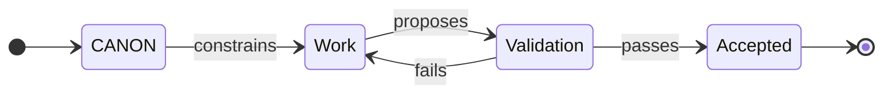

# CANONIC Programming

**Constitutional programming: governance as source code.**

A programming paradigm that uses plain-English constraints + validation gates to enforce system behavior without executable code.

> **The Problem:** AI can generate anything. But can it maintain consistency? Prevent hallucinations? Ensure durability?
>
> **The Solution:** Define constraints (CANONs). Validate every output. Accept only what passes. The CANON IS the program.

---

## Quick Start

**See it in action:**

1. Read [CANONIC.md](CANONIC.md) — The paradigm specification (human-iterated)
2. Read [CANON.md](CANON.md) — The constitution (root governance constraints)
3. Read [DICTIONARY.md](DICTIONARY.md) — Canonical term definitions
4. Explore [examples/](examples/) — Progressive demonstrations
5. Check out [Writing Machine](https://github.com/canonic-machine/writing) — Complex FSM built on this paradigm

---

## Constitutional Nature

The root CANON is the **constitution** of CANONIC programming.

**Constitutional properties:**
- Defines fundamental governance principles (not domain-specific rules)
- Is the deduplication point (define once, inherit everywhere)
- Enables composition (all implementations inherit these principles)
- Must be stable (constitutional law does not churn after maturity)

**The root CANON is the dictionary:**
- Defines what governance terms mean (definitive source of truth)
- Provides canonical definitions used by all implementations
- Mandates DICTIONARY.md in triad (dictionaries all the way down)
- Serves as lexicon for the paradigm

**Producer/consumer as legislative process:**

Producer commits canonify new patterns (legislative).
Consumer commits apply canonical constraints (executive).

```
CANONIC produces → MACHINE consumes
MACHINE produces → Domain applications consume
Domain applications produce → Artifacts consume
```

Each layer is consumer of the layer above, producer for the layer below.

---

## The Core Pattern

**Traditional programming:** Write instructions → compiler enforces syntax → program runs

**CANONIC programming:** Write constraints → validation enforces constraints → outputs accepted



**Key insight:** The CANON IS the program. It defines what valid states look like. Validation gates what exists.

---

## The Triad

All governed directories must contain the minimal triad:

- **CANON.md** - Constraints (LLM-generated, LLM-consumed, token-optimized)
- **DICTIONARY.md** - Term definitions (LLM-generated, alphabetically ordered)
- **README.md** - Human guidance (LLM-generated, human-consumed)

**Generation and consumption flows:**

```
CANON.md: LLM generates → LLM consumes (validators enforce constraints)
DICTIONARY.md: LLM generates (alphabetically ordered terms)
README.md: LLM generates → Human consumes (synthesized documentation)
```

**Human interaction points:**
1. Iterate CANONIC.md (the specification) - Only human entry point
2. Consume README.md (documentation) - Only human output point

**The triad is never directly edited:**

CANON.md, DICTIONARY.md, and README.md are generated fresh by LLM.
Humans never directly edit these files.
All changes flow through CANONIC.md iteration.

**Alphabetical ordering requirement:**

DICTIONARY.md must contain alphabetically ordered term definitions within each section.

This enables:
- Deduplication (find existing terms quickly)
- Consistency (one canonical definition per term)
- Findability (predictable location)

---

## Three-Layer Architecture

CANONIC implementations separate concerns across three layers:

**1. CANONIC (paradigm layer)**
- Defines: constraints, validation, inheritance, triad
- Is: The constitution (this governance repository)
- Produces: Constitutional amendments (canonifications)

**2. MACHINE (validation engine layer)**
- Defines: Constraint checking, git-FSM, self-properties
- Is: Domain-agnostic validation infrastructure
- Consumes: CANONIC constitution
- Produces: Validation framework for domain applications

**3. Domain applications (application layer)**
- Define: Domain-specific FSMs with named states
- Are: Specific implementations (WRITING, DOCUMENTATION, RESEARCH)
- Consume: MACHINE validation framework
- Produce: Validated artifacts

**Maximal separation of concerns:**

State names reveal the layer:
- CANONIC: triad, inheritance, producer/consumer
- MACHINE: validation, git-FSM, self-properties
- WRITING: Episode, Asset, Prose, Output (writing-specific)

---

## Examples

The [examples/](examples/) directory demonstrates CANONIC programming through progressive complexity.

### 1. [hello-world/](examples/hello-world/)
**Simplest possible CANONIC system**

- One file (`hello.txt`)
- One constraint ("Hello, world.")
- Minimal Python validator
- Demonstrates: Basic constraint + validation pattern

**Use this to understand:** How constraints define validity, how validation enforces constraints.

### 2. [simple-fsm/](examples/simple-fsm/)
**State machine with validation gates**

- Three states: draft → review → published
- Transition validation at each gate
- Backflow on validation failure
- Demonstrates: Git-FSM pattern, self-healing through backflow

**Use this to understand:** How commits are state transitions, how validation gates work, how backflow corrects violations.

### 3. [canonic-readme/](examples/canonic-readme/)
**Document governance with nested triads**

- Nested triad structure (project/ subdirectory)
- Inheritance demonstration
- Rich constraints (engagement, structure, code quality)
- Demonstrates: Triad composition, inheritance chains, governance layers

**Use this to understand:** How triads nest, how inheritance works, how constraints compose.

### Complex Application

See [Writing Machine](https://github.com/canonic-machine/writing) for a complete 4-state FSM built on CANONIC programming.

---

## Introspective Properties

CANONIC systems exhibit six self-* properties through **introspection** — the system's ability to examine its own structure, behavior, and constraints.

### Self-Validating
Systems implement dual validation (syntactic + semantic) and validate themselves against their own constraints.

### Self-Optimizing
CANONs stay minimal to minimize token cost across all operations. Semantic violations converge to syntactic constraints.

### Self-Documenting
The triad generates complete documentation automatically. README.md synthesizes from CANON.md + DICTIONARY.md + primary outputs.

### Self-Healing
Git history patterns trigger validation and correction. Backflow returns to source state on failure.

### Self-Measuring
Git commit analysis reveals maturity through producer/consumer ratio.

### Self-Strengthening
Introspection cycles canonify discovered patterns. System learns how to learn better.

---

## Git-FSM Implementation

**Git commits ARE FSM state transitions.**

Every commit proposes a state transition:
- Pre-commit validation acts as gate (accept/reject)
- Rejected commits trigger backflow to source state
- Git history records complete FSM transition log
- Commits must be atomic: one logical change

**Git violation signals:**
- Commit → Revert → Reapply indicates failed validation
- Rapid commit cycles on CANON files indicate drift
- Fix/violation keywords indicate constraint failures

---

## Producer/Consumer Commit Patterns

**Producer commits (legislative):**
- Pattern: `Canonify [what was learned]`
- Add definitions to constitutional dictionary
- Expand governance language
- Occur in governance repository (CANONIC)

**Consumer commits (executive):**
- Patterns: `Apply [constraint]` or `Fix [violation]`
- Apply constitutional requirements
- Speak governance language correctly
- Occur in implementation repositories (MACHINE, domain applications)

**Maturity measurement:**
- Producer ratio = Producer / (Producer + Consumer) percentage
- New system: >40% producer (rapid learning)
- Maturing: 10-30% producer (refinement)
- Mature: <10% producer (stable enforcement)

---

## Core Concepts

### canon
A written set of constraints that define what must be true and what must not occur. The governance layer.

### constraint
A rule that narrows outcomes to a checkable set. Must be verifiable through validation.

### validation
A pass/fail decision procedure that checks artifacts against canon constraints. Binary compliance check.

### artifact
Any output under governance. Examples: documents, diagrams, indices, references, ledgers, code files.

### triad
The three required files in every directory: CANON.md (constraints), DICTIONARY.md (definitions), README.md (human guide).

### invariant
A constraint that cannot be overridden by downstream CANONs. Must hold true across entire inheritance chain.

### inheritance
The mechanism by which downstream CANONs acquire constraints from upstream CANONs. Forms a chain from root to target.

### producer commit (canonification)
A git commit that adds new constraints to CANON.md. Message pattern: "Canonify [what was learned]". Signals discovery.

### consumer commit (implementation)
A git commit that applies existing CANON constraints. Patterns: "Apply [constraint]" or "Fix [violation]". Signals enforcement.

See [DICTIONARY.md](DICTIONARY.md) for complete alphabetically-ordered definitions.

---

## What CANONIC Programming Enables

- Build systems stable across model upgrades
- Collaborate without stylistic or structural drift
- Audit outputs back to source constraints
- Regenerate artifacts reproducibly from governed inputs
- Avoid AI slop without banning AI tools

**The system does not make work easier.**

**It makes work durable.**

---

## Repository Structure

```
canonic/
├── CANONIC.md         # Paradigm specification (human-iterated)
├── CANON.md           # Root constitution (LLM-generated)
├── DICTIONARY.md      # Canonical term definitions (LLM-generated)
├── README.md          # This documentation (LLM-generated)
└── examples/          # Progressive demonstrations
    ├── hello-world/       # Minimal constraint + validation
    ├── simple-fsm/        # State machine with gates
    └── canonic-readme/    # Nested triads + inheritance
```

**Governance purity:** This repository contains ONLY:
- The triad (CANON.md, DICTIONARY.md, README.md)
- Paradigm specification (CANONIC.md)
- Examples (pedagogical demonstrations)

No operational tools, no PROTOCOLS.md, no implementation code.

Implementation repositories (MACHINE, domain applications) add operational tooling.

---

## Non-Negotiables

- CANON defines validity
- Validation gates acceptance
- If output fails, fix inputs or CANON (never polish downstream)
- Root CANON is constitution (must be stable)
- Producer commits precede consumer commits
- Each layer consumes from above, produces for below
- State names reveal domain layer
- Triad is entirely LLM-generated (humans never edit CANON/DICTIONARY/README)
- Humans iterate CANONIC.md only
- Humans consume README only

---

## How to Use This Repository

### For Understanding
1. Read [CANONIC.md](CANONIC.md) — Paradigm specification
2. Study [CANON.md](CANON.md) — Root constitution
3. Review [DICTIONARY.md](DICTIONARY.md) — Term definitions
4. Explore [examples/](examples/) — Hands-on demonstrations

### For Building
1. Start with [examples/](examples/) as templates
2. Create directories with the triad
3. Write constraints in CANON.md
4. Generate artifacts that satisfy constraints
5. Validate outputs against constraints

### For Contributing
1. Follow atomic commit discipline (one logical change per commit)
2. Use commit patterns: "Canonify [pattern]" (producer) or "Apply/Fix [constraint]" (consumer)
3. Maintain triad coherence in all governed directories
4. Maintain governance purity (triad + CANONIC.md + examples only)

---

## Related Documents

- [CANONIC.md](CANONIC.md) — The paradigm specification (human-iterated)
- [CANON.md](CANON.md) — The constitution (LLM-generated governance)
- [DICTIONARY.md](DICTIONARY.md) — Term definitions (LLM-generated, alphabetically ordered)
- [examples/](examples/) — Progressive demonstrations
- [Writing Machine](https://github.com/canonic-machine/writing) — Complex domain application

---

## Meta

This repository practices what it preaches.

Every governed directory contains the triad. Every artifact is validated. The paradigm documents itself.

**This README was generated from CANON.md + DICTIONARY.md + examples/** following the self-documenting protocol.

When CANON or DICTIONARY changes, this README must regenerate to maintain the self-documenting property.

---

**Ready to build durable systems?** Clone the repo and try the examples.
