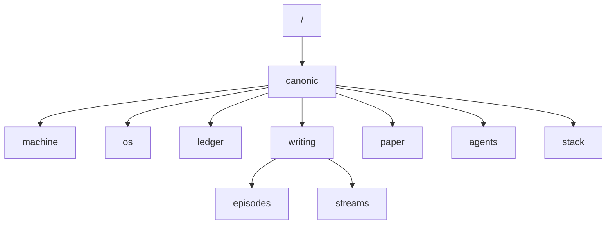

# CANONIC

The constitutional foundation for governed scopes.

---

## Purpose

CANONIC establishes the minimal structural and semantic rules that all downstream scopes must satisfy. It provides the constitutional bedrock for governance across the entire canonbase.

---

## Scope

### In scope

- Paradigm-level axioms for scope validity
- Triad requirements (CANON, VOCAB, README)
- Inheritance semantics
- Introspection requirements
- Layer discipline

### Out of scope

- Implementation details (delegated to MACHINE)
- Procedural rules (delegated to OS)
- Narrative records (delegated to WRITING)

---

## Inheritance

Inherits from: `/`

---

## Triad

| Artifact | Purpose |
|----------|---------|
| [CANON.md](CANON.md) | Governance axioms |
| [VOCAB.md](VOCAB.md) | Vocabulary definitions |
| [README.md](README.md) | This file (non-normative) |

---

## Canonbase

The **canonbase** is the full inheritance graph of all scopes governed by CANONIC, spanning all repositories in a workspace.



## Stack Navigation

| Layer | Repository | Purpose |
|-------|------------|---------|
| Root | **canonic** | Constitutional foundation |
| Enforcement | [machine](https://github.com/canonic-machine/machine) | Execution semantics |
| Bounds | [os](https://github.com/canonic-machine/os) | Operational scope |
| Record | [ledger](https://github.com/canonic-machine/ledger) | Immutable evidence |
| Production | [writing](https://github.com/canonic-machine/writing) | Episode creation |
| Publication | [paper](https://github.com/canonic-machine/paper) | Manuscript artifacts |
| Execution | [agents](https://github.com/canonic-machine/agents) | Subordinate AI |
| Composition | [stack](https://github.com/canonic-machine/stack) | Multi-repo layer |

---

## CANONIC Foundation

CANONIC is stewarded by the **CANONIC Foundation**, a 501(c)(3) non-profit organization.

```
CANONIC Foundation (501(c)(3))
│
├── Mission Products
│   └── MammoChat (free, patient-sovereign)
│
├── IP Trust
│   ├── Patents (70+ IDFs)
│   ├── Validators (black-box, VaaS)
│   └── Specifications
│
├── Revenue Services
│   ├── Validator-as-a-Service
│   ├── Certification Program
│   └── Training
│
└── Licensed Members
    └── OncoNex (Healthcare)
```

See [/companies/foundation/](../companies/foundation/) for Foundation governance.

---

## Quickstart

1. Create scope directory with triad: `CANON.md`, `VOCAB.md`, `README.md`
2. Declare inheritance in CANON: `inherits: /canonic/`
3. Define axioms using normative language (MUST/MUST NOT/MAY)
4. Define all content concepts in VOCAB
5. Validate with CANONIC Foundation VaaS

---

## References

- [CANON.md](CANON.md) — Root governance axioms
- [VOCAB.md](VOCAB.md) — Root vocabulary
- [CANONIC.md](CANONIC.md) — Paradigm specification (non-normative)
- [/companies/foundation/](../companies/foundation/) — Foundation governance
- [/patents/IP-REGISTRY.md](../patents/IP-REGISTRY.md) — IP portfolio

---

*This README is descriptive and non-normative. Governance is defined exclusively by CANON.*
