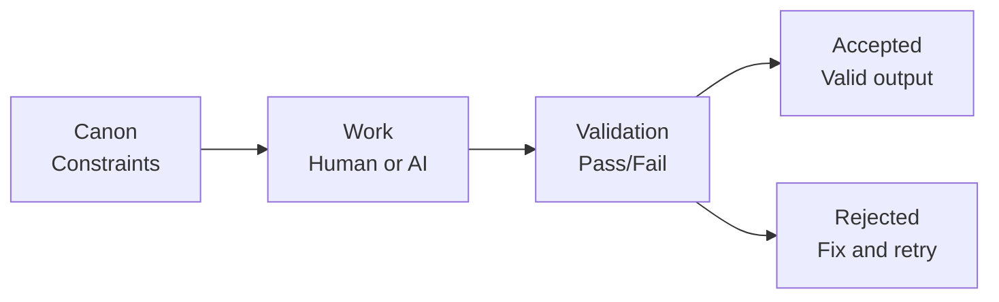

# CANONIC Programming

**Stop AI slop. Enforce durability.**

A programming paradigm that uses plain-English constraints + validation gates instead of executable code.

> **The Problem:** AI can generate anything. But can it maintain consistency? Prevent hallucinations? Ensure traceability?
>
> **The Solution:** Define constraints in plain English (CANONs). Validate every output. Accept only what passes. Like a compiler, but for meaning.

---

## Quick Start

**See it in action:**

1. Read [CANON.md](CANON.md) — Core governance constraints
2. Read [VOCABULARY.md](VOCABULARY.md) — Paradigm terminology
3. Explore [examples/](examples/) — Demonstrations
4. Check out [Writing Machine](https://github.com/canonic-machine/writing) — Complex FSM built on this paradigm

---

## The Core Idea

**Traditional programming:** Write instructions → compiler enforces syntax → program runs

**CANONIC programming:** Write constraints → validation enforces semantics → outputs accepted



**Key insight:** The canon IS the program. It defines what valid outputs look like. Validation is the execution.

---

## What Gets Validated

**Structure:**
- Required files exist
- Naming conventions followed
- Format rules satisfied

**Semantics:**
- Claims trace to sources
- Entities are registered before use
- Definitions exist for all terms

**Coherence:**
- No contradictions
- Inheritance rules respected
- Intent satisfied

---

## The Triad

Every directory must contain three files:

**CANON.md** — Constraints the LLM enforces
```markdown
Required artifacts: hello.txt
Rules:
  - hello.txt must exist
  - Content must be exactly: Hello, world.
```

**VOCABULARY.md** — Term definitions
```markdown
### hello world
The simplest canonic system. One file, one constraint.
```

**README.md** — Human-readable guide
```markdown
This is a hello world example. It shows the minimal
structure of a CANONIC system.
```

---

## Minimal Triad Pattern

For any new governed directory, start with:

```
your-directory/
├── CANON.md      # Constraints (reference root protocols/patterns)
├── VOCABULARY.md # Term definitions (reference/inherit root terms)
└── README.md     # Human guidance
```

Reference root CANON protocols and patterns whenever possible. Only specialize defaults; never restate or override invariants.

---

## Why This Matters

**CANONIC programming is a hedge against AI drift.**

- Canon defines validity **before** generation
- Validation blocks fluent-but-wrong output  
- Same governance works across models and teams
- Outputs remain stable as systems scale

**Real example:** The [Writing Machine](https://github.com/canonic-machine/writing) uses CANONIC programming to enforce traceability across a 50-page user guide. Every claim traces to source episodes. Zero hallucinated references.

---

## What This Enables

Using CANONIC programming makes it possible to:

- **Build systems that survive model upgrades** — Canon is stable, models are swappable
- **Collaborate without drift** — Shared constraints, not just shared files
- **Audit outputs to requirements** — Every artifact traces to canon
- **Avoid AI slop** — Fluency doesn't override validity
- **Make work durable** — Outputs stay consistent over time

---

## Core Concepts

### Canon
A written set of constraints. Defines what must be true and what must not occur.

### Validation
Pass/fail check. Does the artifact satisfy canon constraints?

### Artifact
Any output under governance. Documents, diagrams, indices, ledgers.

### State
Defined by which artifacts exist and which constraints they satisfy.

### Invariant
Constraint that cannot be overridden. Must hold across entire system.

### Protocol
Reusable validation pattern. Define once, reference many times.

See [VOCABULARY.md](VOCABULARY.md) for complete definitions.

---

## Examples

### Canonical README
A governed README with structural requirements.
- [examples/canonical-readme/](examples/canonical-readme/)

### Complex Application
See [Writing Machine](https://github.com/canonic-machine/writing) for a complete FSM (episodes → assets → prose → output) built on this paradigm.

---

## Repository Structure

```
canonic/
├── CANON.md                    # Core governance constraints
├── VOCABULARY.md               # Paradigm terminology
├── README.md                   # This documentation
├── examples/                   # Demonstrations
│   ├── canonical-readme/
└── .gitignore                  # Git configuration
```

Every governed directory contains the triad: CANON.md, VOCABULARY.md, README.md.

---

## How to Use This Repository

### For Understanding
1. Read [CANON.md](CANON.md) — Core governance constraints
2. Study [VOCABULARY.md](VOCABULARY.md) — Understand terminology
3. Explore [examples/](examples/) — See implementations

### For Building
1. Start with [examples/canonical-readme/](examples/canonical-readme/) as template
2. Create directories with the triad: CANON.md, VOCABULARY.md, README.md
3. Write constraints in CANON.md
4. Generate artifacts that satisfy constraints
5. Validate outputs against constraints

---

## What Makes This Different

| Traditional Programming | CANONIC Programming |
|------------------------|---------------------|
| Imperative (how to do) | Declarative (what must be true) |
| Compiler enforces syntax | Validation enforces semantics |
| Code drifts over time | Canon enforces stability |
| Hard to audit | Every artifact traces to canon |
| AI generates slop | AI generates, validation blocks slop |

---

## Applications

CANONIC programming works for any system where consistency matters:

- **Documentation** — READMEs, technical specs, API docs
- **Knowledge systems** — Wikis, knowledge bases, structured content
- **Research** — Papers, citations, reproducible claims
- **Complex writing** — Books, proposals, multi-author projects (see [Writing Machine](https://github.com/canonic-machine/writing))
- **Configuration** — System configs, deployment specs, infrastructure as code

Anywhere AI might generate slop, CANONIC programming blocks it.

---

## Non-Negotiables

- Canon defines validity
- Validation gates acceptance
- If output fails, fix inputs or canon—never polish downstream
- Fluency never substitutes for validity

---

## Related Projects

**[Writing Machine](https://github.com/canonic-machine/writing)** — Complete FSM for durable writing built on CANONIC programming

---

## Contributing

Issues and PRs welcome. When adding directories, maintain the triad.

The paradigm is simple: constraints + validation. Keep it that way.

---

## Meta

This repository practices what it preaches.

Every governed directory contains the triad. Every artifact is validated. The paradigm documents itself.

---

**Ready to stop AI slop?** Clone the repo and try the examples.
