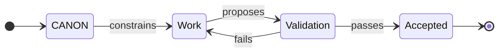
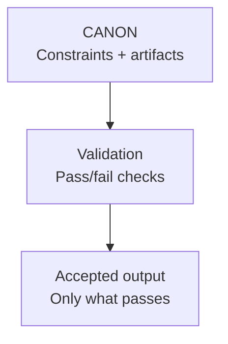
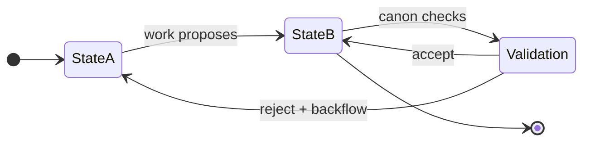

# CANONIC

**Constitutional programming: governance as source code.**

This is the specification. CANONIC.md is human-iterated, explains the paradigm, and defines what CANONIC programming IS.

---

## Constitutional Nature

The root CANON is the **constitution** of CANONIC programming.

**Constitutional properties:**
- Defines fundamental governance principles (not domain-specific rules)
- Is the deduplication point (define once, inherit everywhere)
- Enables composition (all implementations inherit these principles)
- Must be stable (constitutional law does not churn after maturity)

**The root CANON is the vocabulary:**
- Defines what governance terms mean (definitive source of truth)
- Provides canonical definitions used by all implementations
- Mandates VOCAB.md in triad (vocabularies all the way down)
- Serves as lexicon for the paradigm
- VOCAB is temporal - evolves with the machine (not static dictionary)

**Producer/consumer as legislative process:**

Producer commits canonify new patterns (legislative).
Consumer commits apply canonical constraints (executive).

```
CANONIC produces → MACHINE consumes
MACHINE produces → Domain applications consume
Domain applications produce → Artifacts consume
```

Each layer is consumer of the layer above, producer for the layer below.

**Maturity signals:**
- High producer ratio → Constitutional language forming
- Low producer ratio → Constitutional language stabilized
- Static root CANON → Constitution complete

This is the foundation. Everything else is application.

---

## The Problem

LLMs execute through language transformation:
- Drafting structure
- Refactoring content
- Assembling artifacts
- Rewriting to match patterns

But the enforcement layer disappeared.

Traditional programming has compilers that reject invalid programs.
LLM outputs have no compiler. They drift. They hallucinate. They produce fluent violations.

**AI slop:** Fluent, persuasive, wrong.

CANONIC programming restores enforcement without requiring executable code.

---

## Core Definition

CANONIC programming replaces instructions with constraints.

**Two components:**
- **CANON** - Constraints that define validity
- **Validation** - Pass/fail gates that enforce constraints

Work proposes changes. Validation decides what exists.



**The pattern:**
- CANON written once, refined deliberately
- Work done by human, LLM, or both
- Validation non-negotiable (fluency never substitutes for validity)

---

## Three-Layer Architecture

CANONIC implementations separate concerns across three layers:

**1. CANONIC (paradigm layer)**
- Defines: constraints, validation, inheritance, triad
- Is: The constitution (governance repository)
- Produces: Constitutional amendments (canonifications)

**2. MACHINE (validation engine layer)**
- Defines: Constraint checking, git-FSM, self-properties
- Is: Domain-agnostic validation infrastructure
- Consumes: CANONIC constitution
- Produces: Validation framework for domain applications

**3. Domain applications (application layer)**
- Define: Domain-specific FSMs with named states
- Are: Specific implementations (WRITING, DOCUMENTATION, RESEARCH)
- Consume: MACHINE validation framework
- Produce: Validated artifacts

**Maximal separation of concerns:**

State names reveal the layer:
- CANONIC: triad, inheritance, producer/consumer
- MACHINE: validation, git-FSM, self-properties
- WRITING: Episode, Asset, Prose, Output (writing-specific)

Domain names immediately signal which layer you're in.

**Violation:** Validation engine contains domain-specific patterns, or domain application reimplements validation logic.

---

## The Triad

All governed directories must contain the minimal triad:

- **CANON.md** - Constraints (LLM-generated, LLM-consumed, token-optimized)
- **VOCAB.md** - Term definitions (LLM-generated, alphabetically ordered, temporal)
- **README.md** - Human guidance (LLM-generated, human-consumed)

**Generation and consumption flows:**

```
CANON.md: LLM generates → LLM consumes (validators enforce constraints)
VOCAB.md: LLM generates (alphabetically ordered terms, evolves with machine)
README.md: LLM generates → Human consumes (synthesized documentation)
```

**Human interaction points:**
1. Iterate CANONIC.md (the specification) - Only human entry point
2. Consume README.md (documentation) - Only human output point

**The triad is never iterated:**

CANON.md, DICTIONARY.md, and README.md are generated fresh by LLM.
Humans never directly edit these files.
All changes flow through CANONIC.md iteration.

**CANON.md generation:**
- LLM generates constraints via producer commits
- Pattern: "Canonify [what was learned]"
- Token-optimized (minimal, declarative)
- LLM to LLM (never human-edited)

**DICTIONARY.md generation:**
- LLM maintains term definitions
- Always alphabetically ordered within sections
- Terms added as governance evolves
- LLM-generated (never human-edited)

**README.md generation:**
- Input: CANON.md + DICTIONARY.md + primary outputs
- Process: LLM synthesizes sources into human-readable guide
- Output: README.md (replaces completely)
- Trigger: When CANON.md or DICTIONARY.md changes
- Human-consumed (for understanding)

**The triad is recursive:**

The constitution mandates DICTIONARY.md in the triad, which is itself a dictionary pattern - dictionaries all the way down.

Each layer has its own triad. Each triad defines its layer.

**Alphabetical ordering requirement:**

DICTIONARY.md must contain alphabetically ordered term definitions within each section.

This enables:
- Deduplication (find existing terms quickly)
- Consistency (one canonical definition per term)
- Findability (predictable location)

**Violation:** Directory missing any triad file, DICTIONARY.md terms not alphabetically ordered, or any triad file human-edited instead of LLM-generated.

---

## AI-Driven, Human-Governed

**CANONIC programming enables AI-driven execution under human governance.**

**Human role (governance):**
- Set constitutional constraints (CANON)
- Catch violations and enforce compliance
- Approve or reject AI proposals
- Canonify discovered patterns
- Evolve the constitution through CANONIC.md iteration

**AI role (execution):**
- Generate artifacts at scale (triads, validators, examples)
- Apply canonical constraints
- Self-validate against governance
- Self-correct when violations detected
- Propose patterns for canonification

**The governance model:**

Humans are governors general of AI execution. They do not micromanage implementation—they set constitutional boundaries and enforce compliance.

AI executes within governed constraints. It determines HOW to satisfy requirements, but not WHAT the requirements are.

CANON is the constitution. It defines validity. Neither human nor AI can violate it.

**Division of authority:**
- Human: Strategic decisions, governance evolution, violation detection
- AI: Tactical execution, pattern application, artifact generation
- CANON: Constitutional enforcement, validity gates, compliance boundaries

**This is not:**
- Human-directed (too prescriptive, micromanagement)
- AI-autonomous (ungoverned, drift-prone)
- Collaborative editing (humans never edit triad files)

**This is:**
- Constitutional programming
- Governed execution at scale
- Durable AI outputs through human oversight

---

## Agent Programming

**CANONs are the sole source of truth.**

Agents program by generating CANONs, not artifacts.

**The pattern:**
1. LLM generates CANON.md (adds constraints via producer commits)
2. CANON constrains artifacts
3. Validation enforces constraints against artifacts
4. Artifacts update to satisfy CANON
5. Validation gates acceptance

**Violations:**
- Human directly edits CANON/DICTIONARY/README (bypasses LLM generation)
- Agent adds content without CANON constraint (ungoverned)
- Agent explains in README instead of constraining in CANON (wrong layer)

**Rationale:**

CANONs are declarative governance. They state what must be true.
Artifacts are derived outputs. They satisfy constraints.

LLM-generated CANONs create stability. Human iteration of CANONIC.md creates evolution.

---

## Declarative Governance

**CANONs declare constraints. LLMs implement enforcement.**

**CANON structure:**
- What must be true (invariants, constraints)
- What must not occur (violations)
- Validation outcomes (pass/fail)
- Protocol references (reusable patterns)

**NOT in CANONs:**
- How to implement (LLM interprets)
- Step-by-step procedures (extract to protocols)
- Explanations (README)
- Examples (README)

**Distinction:**

Imperative: "Run validation. Check each reference. Report violations."
Declarative: "References must resolve. Violations block output."

LLM determines implementation. CANON states requirement.

---

## Token Economics

**Tokens are the computational unit in CANONIC programming.**

Every validation loads CANONs. Inheritance chains compound cost.

**Cost model:**
```
Validation cost = root CANON + parent CANON(s) + local CANON
```

Deep hierarchies multiply cost:
```
root (500) + parent (300) + child (200) = 1000 tokens/validation
10 validations/hour = 10,000 tokens/hour for CANON loading
```

**Optimization imperative:**

CANONs must be minimal. Verbose CANONs increase every operation cost.

**Principles:**
- Atomic: state constraints, not implementations
- Minimal: zero prose, zero examples, zero explanations
- Declarative: what must be true (LLM determines how)
- Protocol references: don't duplicate patterns

**Refactor signals:**
- Duplication across CANONs → extract protocol
- Procedural language → remove or extract
- Prose explanations → move to README
- Length divergence → extraction opportunity

Token cost impacts development velocity, API costs, and context window usage.

Optimizing CANONs optimizes the entire system.

---

## Producer/Consumer Legislative Process

**Producer commits canonify new patterns. Consumer commits apply canonical constraints.**

**Producer commits (legislative):**
- Add definitions to constitutional dictionary
- Expand governance language
- Pattern: `Canonify [what was learned]`
- Occur in governance repository (CANONIC)

**Consumer commits (executive):**
- Apply constitutional requirements
- Speak governance language correctly
- Patterns: `Apply [constraint]` or `Fix [violation]`
- Occur in implementation repositories (MACHINE, domain applications)

**Legislative flow:**
```
CANONIC produces → MACHINE consumes
MACHINE produces → Domain applications consume
Domain applications produce → Artifacts consume
```

Each layer consumes from above, produces for below.

**Prohibited commit patterns:**
- "Add..." (ambiguous - use "Canonify" or "Apply")
- "Update..." (ambiguous - use "Apply" or "Fix")
- "Implement..." (ambiguous - use "Apply")
- "Complete..." (ambiguous - use "Apply")

**Producer-before-consumer ordering:**
- Canonify constraint FIRST (producer commit in governance repo)
- Apply constraint SECOND (consumer commit in implementation repo)
- Cannot apply non-canonical patterns

**Production triggers consumption:**
- Every producer commit must trigger consumer commits across affected repositories
- Implementations must be compliant before session ends
- Validation gates ensure compliance

**Maturity measurement:**
- Producer ratio = Producer / (Producer + Consumer) percentage
- New system: >40% producer (rapid learning)
- Maturing: 10-30% producer (refinement)
- Mature: <10% producer (stable enforcement)

**Violation:** Consumer commit precedes producer commit, implementation produces without consuming upstream constraints, or root CANON shows continuous churn after paradigm stabilization.

---

## Inheritance Without Contradiction

**Implementation repositories inherit from protocol specifications via markdown links.**

Inheritance is declarative:
- Markdown links only
- No git submodules
- No scripts
- No tooling

**Inheritance rules:**
- Downstream may specialize defaults
- Downstream may add constraints
- Downstream cannot contradict upstream invariants
- Downstream cannot loosen upstream constraints

**Examples requirement:**

Governance repositories must include examples directory demonstrating the paradigm.

**Violation:** Governance repository missing examples directory, or implementation claims to inherit from non-existent files.

---

## Git-FSM Implementation

**Git commits ARE FSM state transitions.**

Every commit proposes a state transition:
- Pre-commit validation acts as gate (accept/reject)
- Rejected commits trigger backflow to source state
- Git history records complete FSM transition log
- Commits must be atomic: one logical change

**Commit structure:**
- Atomic (single logical change, one constraint addressed)
- Validated (passes pre-commit gates)
- Traceable (clear producer vs consumer action)

**Git violation signals:**
- Commit → Revert → Reapply indicates failed validation
- Rapid commit cycles on CANON files indicate drift
- Fix/violation keywords indicate constraint failures

---

## Self-Properties

MACHINE implements three self-properties via git introspection:

### Self-Healing

System detects violations through git history patterns and triggers recovery.

### Self-Measuring

System measures maturity through git commit analysis (producer ratio).

### Self-Strengthening

System improves through git-based introspection cycles.

**Pattern:** Work → Introspection → Learning → Canonification → Meta-Pattern Discovery → Recursive Strengthening

Each canonification makes future violations easier to catch.
Meta-patterns about improvement are themselves canonified.
System learns how to learn better.

---

## Executable Code Integration

CANONIC programming does not eliminate traditional code.

It establishes the relationship: CANONs govern, code implements.

**Division of labor:**

CANONs (declarative):
- What must be true
- What constitutes validity
- What artifacts must exist
- What constraints apply

Code (imperative):
- How to automate checks
- How to transform data
- How to extract/generate
- How to integrate systems

**Key principle:**

If you're writing procedural logic to enforce governance → that logic belongs in CANON (declaratively).

If you're writing complex computation that CANONs reference → that's appropriate script territory.

Scripts are ephemeral (can be replaced/rewritten).
CANONs are durable (invariants persist across implementations).

---

## The CANON is the Program

In traditional programming, the program is instruction sequence.

In CANONIC programming, the program is the **definition of valid states**.



This makes CANONIC programming **accelerant-agnostic**:
- Work produced by person, model, agent loop, or future toolchain
- CANON and validation rules remain stable

---

## Canonic FSMs

Domain applications define their own finite state machines.

**A Canonic FSM has:**
- Named states (domain-specific, reveal the domain)
- Allowed transitions (which states flow to which)
- Transition canon (what must be true to transition)
- Backflow rules (where to return on failure)



**Why FSMs fit CANONIC:**

Traditional FSMs encode transitions as executable functions.
Canonic FSMs encode transitions as validation conditions.

Work proposes state changes. CANON decides what's accepted.

This makes FSMs:
- Inspectable (states and rules are readable)
- Portable (same rules work across tools/models)
- Auditable (every transition has compliance record)
- Backflow-capable (failed transitions return to fixable states)

**State names reveal domain:**

WRITING: Episode → Asset → Prose → Output (writing domain)
MCODE: Spec → Code → Tests → Binary (translation domain)
DOCUMENTATION: Requirements → Structure → Content → Publish (docs domain)

MACHINE does not define state names. Domain applications do.

---

## What CANONIC Programming Enables

- Build systems stable across model upgrades
- Collaborate without stylistic or structural drift
- Audit outputs back to source constraints
- Regenerate artifacts reproducibly from governed inputs
- Avoid AI slop without banning AI tools

The system does not make work easier.

It makes work durable.

---

## Non-Negotiables

- CANON defines validity
- Validation gates acceptance
- If output fails, fix inputs or CANON (never polish downstream)
- Root CANON is constitution (must be stable)
- Producer commits precede consumer commits
- Each layer consumes from above, produces for below
- State names reveal domain layer
- Triad is entirely LLM-generated (humans never edit CANON/DICTIONARY/README)
- Humans iterate CANONIC.md only
- Humans consume README only

---

## Related Documents

- `CANON.md` — The constitution (LLM-generated governance)
- `DICTIONARY.md` — Term definitions (LLM-generated, alphabetically ordered)
- `README.md` — Human guidance (LLM-generated from CANON + DICTIONARY + examples)
- `../machine/` — Validation engine (constraint checking, git-FSM)
- `../writing/` — Domain application (4-state FSM for writing)

---

End of CANONIC specification.
