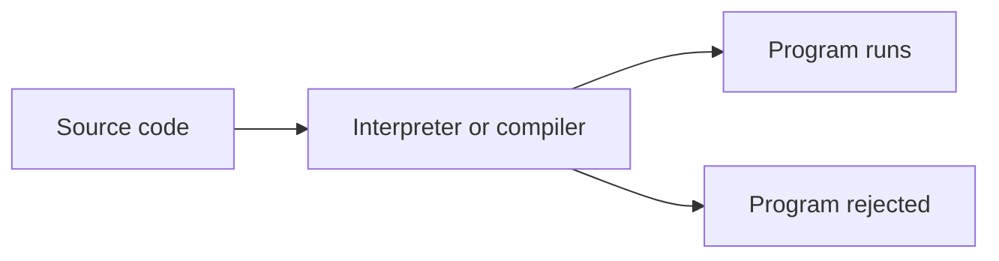
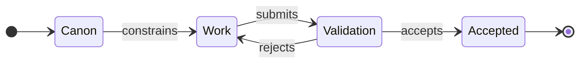
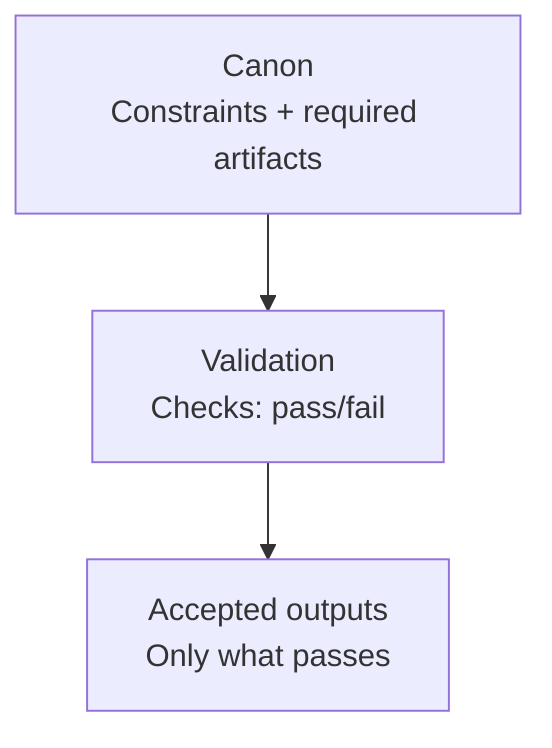
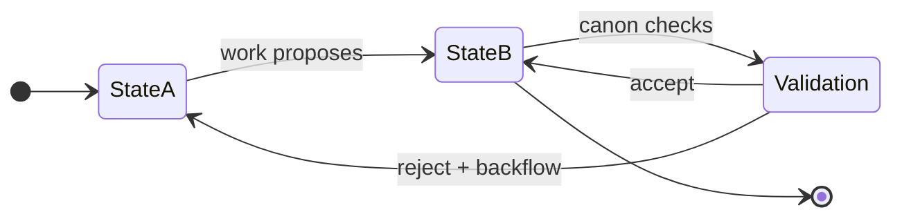
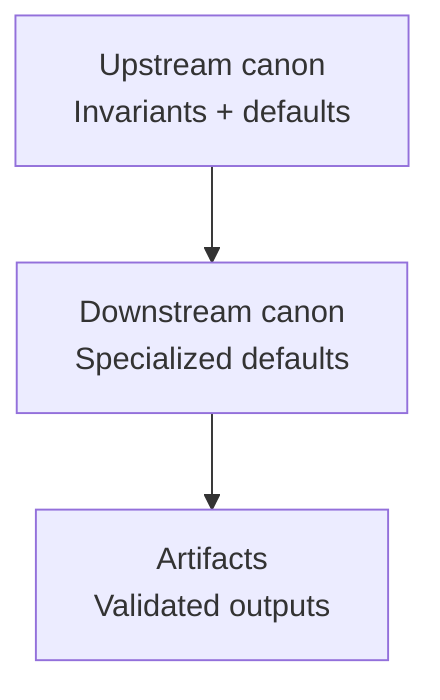
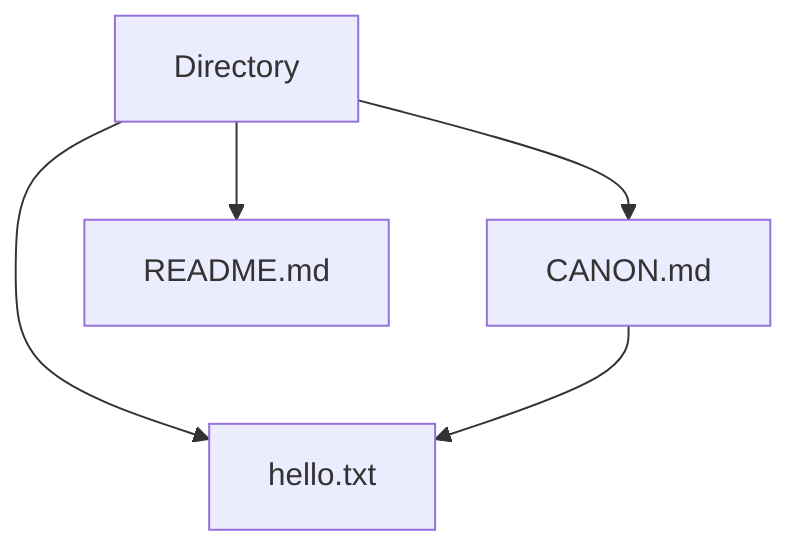

# canonic

This document defines **CANONIC programming**: a way to program systems using **plain-English governance** (constraints + validation) instead of executable code.

It is the foundational spec for this repository. Other docs may reference it, but must not redefine it.

---

## Traditional programming and the toolchain

Traditional software relies on **instructions** written in a programming language and enforced by a toolchain.

- An **interpreter** executes instructions directly at runtime.
- A **compiler** translates instructions into a runnable form and rejects programs that violate the language rules.

The toolchain is the enforcement layer. It defines what counts as a valid program and blocks what does not.



*Figure CP-1 — Traditional programming: source code is accepted or rejected by an interpreter/compiler toolchain.*

The important idea is not the syntax. It is the pattern:

- **Write instructions** → **enforce rules** → **accept or reject**.

---

## What changed with LLMs and agents

LLMs and agent workflows changed the surface area of "execution." Many tasks that previously required code can now be carried out through **language-driven transformation**:

- drafting text and structure,
- refactoring documents,
- rewriting content to match constraints,
- assembling artifacts from inputs.

But the new toolchain is unstable by default.

- Outputs drift over time.
- Definitions blur.
- Structure becomes inconsistent.
- The prose can sound correct while violating requirements.

That failure mode is widely described as **AI slop** (fluent output that is cheap, repetitive, or wrong).

The result: the old enforcement layer (compiler/interpreter) no longer reliably exists for many knowledge-work outputs.

CANONIC programming restores enforcement — without requiring executable code.

---

## Core definition

CANONIC programming replaces step-by-step instructions with two things:

- **Canon**: the constraints that define what is valid.
- **Validation**: pass/fail checks that decide what can be accepted.

A CANONIC system behaves like a governed state machine: work can propose changes, but **only validated states are accepted**.



*Figure CP-2 — CANONIC programming loop: canon constrains work; validation gates acceptance.*

Narrative:
- **Canon** is written once and refined deliberately.
- **Work** may be done by a human, an LLM, or both.
- **Validation** is non-negotiable. Fluency never substitutes for validity.

---

## Agent programming paradigm

**CANONs are the sole source of truth.**

In CANONIC systems, agents and LLMs program by editing CANONs, not artifacts.

**The pattern:**
1. Agent edits CANON to add/modify constraints
2. CANON constrains what artifacts must contain
3. Machine validates artifacts against CANON
4. Artifacts update to satisfy CANON
5. Validation gates acceptance

**Violations:**
- Agent directly edits prose/output (bypasses governance)
- Agent adds content without CANON constraint (ungoverned)
- Agent explains in artifact instead of constraining in CANON (wrong layer)

**Rationale:**

CANONs are declarative governance. They state what must be true.
Artifacts are derived outputs. They satisfy constraints.

Direct artifact editing creates drift. CANON editing creates stability.

---

## Declarative governance model

**CANONs declare constraints. LLMs implement enforcement.**

**CANON structure:**
- What must be true (invariants, constraints)
- What must not occur (violations)
- Validation outcomes (pass/fail)
- Protocol references (reusable patterns)

**NOT in CANONs:**
- How to implement (LLM interprets)
- Step-by-step procedures (extract to protocols)
- Explanations of rationale (README)
- Examples (README)

**Distinction from imperative:**

Imperative: "Run validation on save. Check each asset reference. Report violations."
Declarative: "Asset references must resolve to LEDGER.md. Violations block output."

LLM determines implementation. CANON states requirement.

---

## Token economics as execution cost

**In CANONIC programming, tokens are the computational unit.**

Every validation loads CANONs. Inheritance chains compound cost.

**Cost model:**
```
Validation cost = root CANON + parent CANON(s) + local CANON
```

For deep hierarchies:
```
root (500 tokens) + parent (300 tokens) + child (200 tokens) = 1000 tokens/validation
```

Active development: 10 validations/hour = 10,000 tokens/hour just for CANON loading.

**Optimization imperative:**

CANONs must be minimal. Verbose CANONs increase every operation cost.

**Principles:**
- Atomic: state constraints, not implementations
- Minimal: zero prose, zero examples, zero explanations  
- Declarative: what must be true (LLM determines how)
- Protocol references: don't duplicate patterns

**Refactor signals:**
- Duplication across CANONs → extract protocol
- Procedural language → remove or extract
- Prose explanations → move to README
- Length divergence → extraction opportunity

**Measurement:**

Token cost directly impacts:
- Development velocity (faster validation = faster iteration)
- API costs (cumulative token usage)
- Context window usage (smaller CANONs leave room for artifacts)

Optimizing CANONs optimizes the entire system.

---

## Executable code integration

**CANONIC programming does not eliminate traditional code.**

It establishes the relationship: CANONs govern, code implements.

**Division of labor:**

*CANONs (declarative):*
- What must be true
- What constitutes validity
- What artifacts must exist
- What constraints apply

*Code (imperative):*
- How to automate checks
- How to transform data
- How to extract/generate
- How to integrate systems

**Example:**

CANON declares: "All asset IDs must be unique and sequential."

Script implements: Validation runner that checks LEDGER.md and reports violations.

The CANON is truth. The script is a tool.

**Key principle:**

If you're writing procedural logic to enforce governance → that logic belongs in CANON (declaratively).

If you're writing complex computation that CANONs reference → that's appropriate script territory.

**Scripts are ephemeral.** They can be replaced, rewritten, or eliminated as tooling evolves.

**CANONs are durable.** They define the invariants that persist across implementations.

---

## The canon is the program

In traditional programming, the "program" is the instruction sequence.

In CANONIC programming, the "program" is the **definition of valid states and artifacts**.



*Figure CP-3 — Canon contract: constraints define checks; checks define what may exist as accepted output.*

This makes CANONIC programming **accelerant-agnostic**:
- The work can be produced by a person, a model, an agent loop, or a future toolchain.
- The canon and validation rules remain stable.

---

## Key terms

**Canon**
- A written set of constraints that define what *must* be true and what *must not* occur.

**Constraint**
- A rule that narrows outcomes to a checkable set (e.g., "must contain exactly one H1").

**Validation**
- A pass/fail decision procedure. If it cannot be checked, it is guidance, not canon.

**Artifact**
- Any output under governance (docs, diagrams, indices, references, ledgers).

**State**
- A stable condition defined by which artifacts exist and which constraints they satisfy.

**Protocol** (optional term)
- A named operation that attempts a state transition (often useful in larger systems).

---

## Canonic Finite State Machines

Many CANONIC systems benefit from explicit state modeling.

A **Canonic FSM** is a finite state machine where:
- States are defined by which artifacts exist and what constraints they satisfy
- Transitions are work operations (human, LLM, or tool-driven)
- Canon defines which transitions are allowed
- Validation gates every transition

### Structure

A Canonic FSM requires:

1. **Named states** — explicit phases with defined artifacts
2. **Allowed transitions** — which states can flow to which others
3. **Transition canon** — what must be true for each transition to succeed
4. **Backflow rules** — where to return on validation failure



*Figure CP-4 — Canonic FSM: work proposes transitions; validation enforces canon; failed transitions backflow to source state.*

### Example: Three-state document system

Consider a simple documentation workflow:

**States:**
- **Draft** — content exists but ungoverned
- **Reviewed** — content satisfies structural canon
- **Published** — content is frozen and versioned

**Transitions:**
- Draft → Reviewed (requires: all required sections present, no broken links)
- Reviewed → Published (requires: approval signature, version tag)
- Published → Draft (backflow: fix content, increment version)

**Canon enforces:**
- Draft may contain incomplete sections
- Reviewed must have: title, author, date, all required H2 sections
- Published must be immutable (edits require new version)

**Validation:**
Each transition has a compliance check. If the check fails, the system returns to the source state with specific violations listed.

### Why FSMs fit CANONIC programming

Traditional FSMs encode transitions as executable functions.

Canonic FSMs encode transitions as **validation conditions**.

The work (human or LLM) proposes state changes.
The canon decides which changes are accepted.

This makes the FSM:
- **Inspectable** — states and rules are readable
- **Portable** — same rules work across tools/models
- **Auditable** — every transition has a compliance record
- **Backflow-capable** — failed transitions return to fixable states

### Minimal Canonic FSM

The smallest useful Canonic FSM has:
- Two states (input and output)
- One forward transition (with validation)
- One backflow transition (to fix violations)

This is sufficient for many single-artifact systems like READMEs, configurations, or simple ledgers.

Complex systems (like writing machines for papers or books) use multi-state FSMs with branching and parallel paths, but the same principles apply.

---

## Writing a good canon

A canon is only useful if it prevents drift without creating bureaucracy.

A strong canon is:

1. **Explicit**
   - Prefer "must / must not / exactly one / at least one."
   - Avoid "should / nice / better."

2. **Checkable**
   - Every rule implies a test.
   - If the test cannot be described, the rule is not ready.

3. **Minimal**
   - Start small.
   - Add constraints only when a real failure mode appears.

4. **Portable**
   - Written in plain language.
   - Enforceable by different humans and different LLMs.

---

## Canon layering (inheritance without contradiction)

Large systems usually require multiple canons.

- Upstream canon defines **invariants**.
- Downstream canon may **specialize defaults** for its scope.
- Downstream canon must not contradict upstream invariants.



*Figure CP-5 — Layering: downstream may specialize defaults while preserving upstream invariants.*

This is the minimal inheritance rule:
- **Invariant vs anything** → invariant wins.
- **Default vs local specialization** → local specialization wins.

No extra metadata is required for the MVP. Filesystem location defines scope.

---

## Canonical Hello World

The smallest CANONIC program is a canon that constrains one artifact.



*Figure CP-6 — Hello World: CANON.md constrains a single required artifact.*

Example canon (plain English):

```text
Required artifacts:
  - hello.txt

Rules:
  - hello.txt must exist
  - hello.txt content must be exactly: Hello, world.
```

Validation is straightforward:
- does the file exist?
- does its content match exactly?

### From Hello World to Canonical README

A canonical `README.md` can be governed as a structured artifact rather than narrative text.

Example constraints for a canonical README:

- The README must exist.
- It must contain exactly one top-level heading (H1) with the project name.
- It must include at least two sections with second-level headings (H2): "Overview" and "Usage".
- Diagrams are allowed only as Mermaid code blocks and must be properly fenced.
- File naming must be exact: `README.md` (case-sensitive).
- No raw HTML or unsupported markdown extensions are permitted.

Validation checks include:

- Confirming the file exists.
- Verifying the presence and uniqueness of the H1 heading.
- Checking required H2 sections are present.
- Ensuring diagrams use correct Mermaid fences.
- Confirming file name matches exactly.
- Rejecting any unsupported content.

Pass/fail decisions are binary: the README is either valid or rejected.

### Scaling the Same Canon

The same CANONIC programming model applies to larger documentation systems without modification.

For example, the canon can govern:

- A README document with structural and naming constraints.
- A protocol document defining specific operations and expected formats.
- A system architecture document requiring diagrams, references, and section order.

Each artifact has defined existence and content rules.

Validation remains a pass/fail gate on each artifact's compliance.

The programming model is stable: canon defines constraints, work produces artifacts, validation enforces acceptance.

No executable code is required; governance is expressed in plain English rules.

---

## Why this matters

CANONIC programming is a hedge against LLM drift and AI slop.

- The canon defines validity before generation.
- Validation blocks persuasive-but-invalid output.
- The same governance can be executed by different models and different teams.

This repository uses CANONIC programming to make complex writing systems reproducible.

---

## What CANONIC programming enables

Using CANONIC programming makes it possible to:

- Build systems that remain stable across model upgrades
- Collaborate without stylistic or structural drift
- Audit outputs back to source constraints
- Regenerate artifacts reproducibly from governed inputs
- Avoid AI slop without banning AI tools

The system does not try to make work easier.

It makes work durable.

---

## Non-negotiables

- The canon defines validity.
- Validation gates acceptance.
- If an output fails, fix the inputs or the canon before polishing sentences.

---

## Related documents

- `WRITING_MACHINE.md` — Application of CANONIC programming to structured authorship
- Individual `CANON.md` files in each directory — Local governance specifications

---

End of `CANONIC_PROGRAMMING`.
