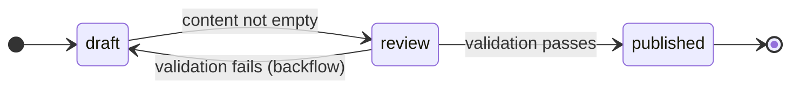

# Simple FSM

**A basic finite state machine with validation gates.**

This example demonstrates state transitions, validation gates, and backflow in CANONIC programming.

---

## What This Demonstrates

**Core Concepts:**
- State transitions governed by CANON
- Validation gates that block invalid transitions
- Backflow when validation fails
- Terminal states (immutable final state)

---

## The State Machine



**States:**
- **draft**: Initial state, content editable
- **review**: Validation state, checks content requirements
- **published**: Terminal state, content immutable

**Transitions:**
- draft → review: Requires non-empty content
- review → published: Requires valid content (capitalization, punctuation)
- review → draft: Backflow when validation fails

---

## How to Use

### 1. Check initial state
```bash
cat state.txt
# Output: draft
```

### 2. Edit the content
```bash
echo "Hello world" > draft.txt
```

### 3. Attempt transition to review
```bash
python3 transition.py review
```

**If content valid:**
```
Current state: draft
Validating transition: draft → review
✓ draft.txt is not empty
✓ Content length >= 10 characters
Transition successful: draft → review
```

**If content invalid:**
```
Current state: draft
Validating transition: draft → review
✗ Content too short (need >= 10 characters)
Transition blocked. Violations must be fixed.
State remains: draft
```

### 4. From review, publish or backflow
```bash
python3 transition.py published
```

**If validation passes:**
```
Current state: review
Validating transition: review → published
✓ Content starts with capital letter
✓ Content ends with period
✓ No profanity detected
Transition successful: review → published
```

**If validation fails:**
```
Current state: review
Validating transition: review → published
✗ Content must end with period
Backflow triggered: review → draft
Fix violations and retry.
```

### 5. Published state is terminal
```bash
python3 transition.py draft
```

Output:
```
Current state: published
Error: No transitions allowed from terminal state 'published'
```

---

## What You Learn

1. **State transitions**: System moves between defined states
2. **Validation gates**: Transitions require passing validation
3. **Backflow**: Failed validation returns to previous state
4. **Binary decisions**: Pass or fail, no subjective judgment
5. **Terminal states**: Final states are immutable
6. **FSM enforcement**: CANON defines valid transitions, validation enforces them

This is a minimal FSM. Real systems (like the Writing Machine) have more states and complex validation, but follow the same pattern.

---

## Experiment

Try these scenarios:

**Scenario 1: Skip review (should fail)**
```bash
echo "draft" > state.txt
echo "Test content." > draft.txt
python3 transition.py published  # Should fail: invalid transition
```

**Scenario 2: Invalid content (backflow)**
```bash
echo "draft" > state.txt
echo "no capitalization or period" > draft.txt
python3 transition.py review      # Should succeed
python3 transition.py published   # Should backflow to draft
```

**Scenario 3: Valid flow**
```bash
echo "draft" > state.txt
echo "This is valid content." > draft.txt
python3 transition.py review      # Should succeed
python3 transition.py published   # Should succeed
```

---

## Next Steps

After understanding this FSM:
- Study the 4-state CANONIC FSM in [MACHINE.md](https://github.com/canonic-machine/machine)
- See real-world application in [Writing Machine](https://github.com/canonic-machine/writing)

---

End of simple-fsm README.
