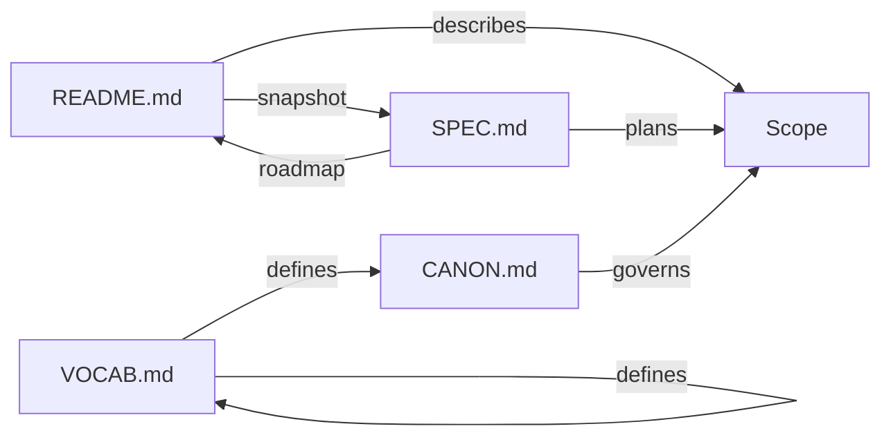
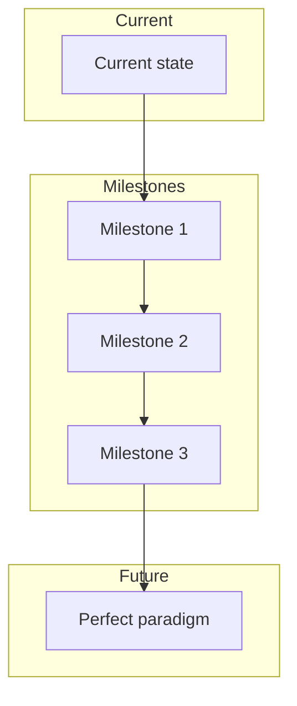

# SPEC (<SCOPE PATH>)

The master plan for this scope.

---

## 1. Purpose

<State the purpose of this SPEC and what it governs.>

---

## 2. Scope

- Applies to `<SCOPE PATH>`.
- Informs inherited scopes.
- This SPEC is descriptive and human-first.

---

## 3. Artifact relationships

| Artifact | Role | Authority |
|----------|------|-----------|
| CANON.md | Governance axioms | Normative |
| VOCAB.md | Vocabulary definitions | Normative |
| README.md | Current state snapshot | Descriptive |
| SPEC.md | Master plan & roadmap | Descriptive |

---

## 4. Normative language

The key words **MUST**, **MUST NOT**, **SHOULD**, **SHOULD NOT**, and **MAY** are to be interpreted as described in RFC 2119.

Statements using these key words are normative. Examples are non-normative unless explicitly marked otherwise.

---

## 5. Principles

### 5.1 Separation of concerns

<State high-level design principles that explain intent without defining governance.>

### 5.2 Minimality

<State principles that limit scope and prevent bloat.>

### 5.3 Evolution toward perfect paradigm

All artifacts evolve through canonification toward the ideal structural form defined by CANONIC templates.

---

## 6. Constraints

<State constraints that describe how CANON, VOCAB, README, and templates relate.>

<State what this SPEC explicitly does not govern.>

---

## 7. Validation

<State how downstream consumers (e.g., MACHINE implementations) may check compliance with this SPEC.>

---

## 8. Generation metadata

| Field | Value |
|-------|-------|
| Created | <YYYY-MM-DD> |
| Last updated | <YYYY-MM-DD> |
| Generator | <Human / AI-assisted / Episode ID> |
| Template version | te003 |

---

## 9. Roadmap

### 9.1 Current state

<Reference README.md for current snapshot.>

See [README.md](README.md) for the current state of this scope.

### 9.2 Next milestones

- <Milestone 1>
- <Milestone 2>
- <Milestone 3>

### 9.3 Future vision

<Describe the target state this scope is evolving toward.>

---

## 10. Consumption notes

<State guidance for downstream use, updates, naming, and inheritance.>

---

## 11. References

- [CANON.md](CANON.md) — Governance axioms
- [VOCAB.md](VOCAB.md) — Vocabulary definitions
- [README.md](README.md) — Current state snapshot
- <Related episodes>
- <Related IDFs>

---

**This SPEC is descriptive and non-authoritative.**
**Governance is defined exclusively by CANON.**

---
