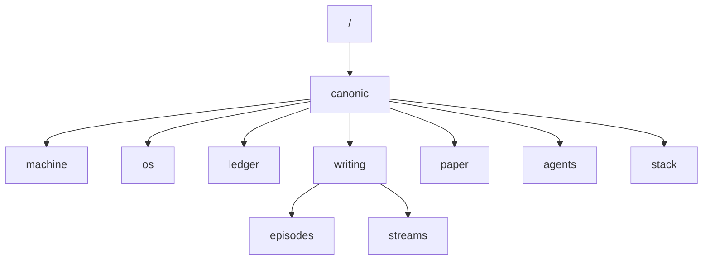

# <SCOPE NAME>

<One-line description of this scope.>

---

## Governance Path

`<GOVERNANCE PATH>` (e.g., `/canonic/machine/validators/`)

Inherits from: `<PARENT GOVERNANCE PATH>`

<!--
GOVERNANCE PATH: Logical inheritance chain
Filesystem assumed flat: all ledgers are siblings at CANONBASE root
-->

---

## Purpose

<State why this scope exists.>

---

## Scope

### In scope

- <Describe what this scope covers.>

### Out of scope

- <Describe what this scope explicitly does not cover.>

---

## Canonbase

The **canonbase** is the full inheritance graph of all scopes governed by CANONIC, spanning all repositories in a workspace.

## Stack Navigation

| Layer | Repository | Purpose |
|-------|------------|---------|
| Root | [canonic](https://github.com/canonic-machine/canonic) | Constitutional foundation |
| Enforcement | [machine](https://github.com/canonic-machine/machine) | Execution semantics |
| Bounds | [os](https://github.com/canonic-machine/os) | Operational scope |
| Record | [ledger](https://github.com/canonic-machine/ledger) | Immutable evidence |
| Production | [writing](https://github.com/canonic-machine/writing) | Episode creation |
| Publication | [paper](https://github.com/canonic-machine/paper) | Manuscript artifacts |
| Execution | [agents](https://github.com/canonic-machine/agents) | Subordinate AI |
| Composition | [stack](https://github.com/canonic-machine/stack) | Multi-repo layer |

---

## Quickstart

1. <Step one.>
2. <Step two.>
3. <Step three.>

---

## Repository metadata (root only)

If this scope is a repository root, include:

- `LICENSE`
- `NOTICE`

---

## References

- `CANON.md`
- `VOCAB.md`
- `<SPEC.md (if present)>`

---

*This README is descriptive and non-normative. Governance is defined exclusively by CANON.*

---
